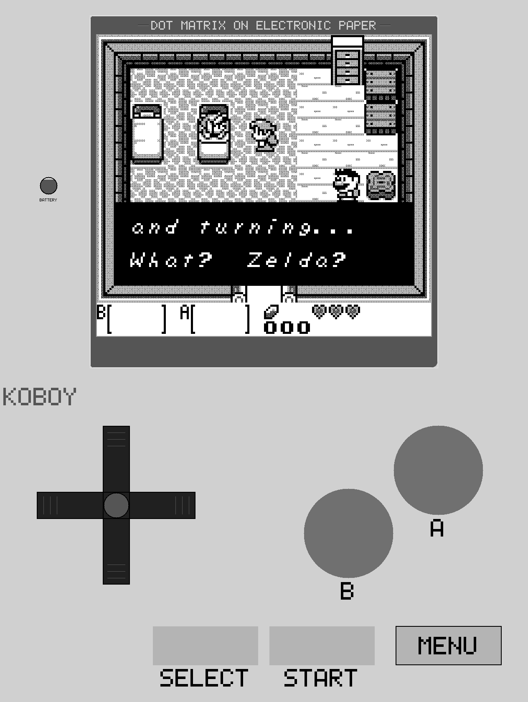
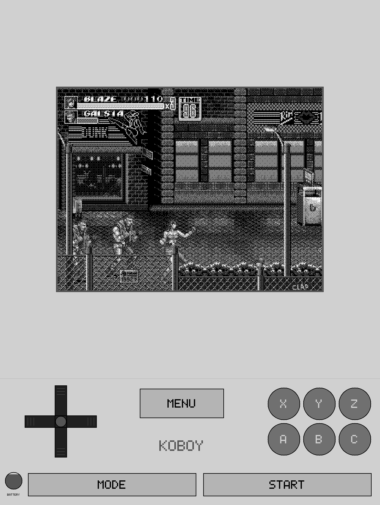

# koboy

**Retro games on a Kobo e-reader.** Copy one folder to your Kobo over USB,
put some ROMs beside it, and launch it from the reader's own menu. It plays
fifteen systems, from the Game Boy to the Super Nintendo to 1980s arcade
boards, on the e-ink screen you already own.

**Support the developer:**

---

<table>
<tr>
<td width="50%"></td>
<td width="50%"></td>
</tr>
<tr>
<td align="center"><em>Game Boy — the faceplate koboy started with</em></td>
<td align="center"><em>Mega Drive — six buttons, laid out like the real pad</em></td>
</tr>
</table>

**[More screenshots, grouped by system →](docs/SCREENSHOTS.md)**

---
Most of the code was written by Claude, directed and reviewed by a professional software developer.
---
## Systems

| System | File extension | Emulator core | BIOS needed? |
|---|---|---|---|
| Game Boy / Game Boy Color | `.gb` `.gbc` | gambatte | no |
| Game Boy Advance | `.gba` | gpSP | no — built into the core |
| Game & Watch | `.mgw` | gw-libretro | no |
| NES | `.nes` | fceumm | no |
| SNES | `.sfc` `.smc` | snes9x2005 | no |
| Master System / Game Gear | `.sms` `.gg` | Genesis Plus GX | no |
| Mega Drive / Genesis | `.md` | Genesis Plus GX | no |
| PC Engine / TurboGrafx-16 | `.pce` | beetle-pce-fast | no |
| Atari 2600 | `.a26` | stella2014 | no |
| WonderSwan / WS Color | `.ws` `.wsc` | beetle-wswan | no |
| Neo Geo Pocket / Color | `.ngp` `.ngc` | RACE | no |
| Pokémon Mini | `.min` | PokeMini | no |
| **ColecoVision** | `.col` | Gearcoleco | **yes — you supply it** |
| **Intellivision** | `.int` | FreeIntv | **yes — you supply it** |
| Arcade | `.zip` | FinalBurn Neo | no, for the 1980s boards |

**Thirteen of the fifteen need no BIOS at all.** Two do, and neither file is
distributed here because neither is ours to distribute. Put them in
`.adds/koboy/` itself — the folder the `koboy` program is in, not `roms/`:

| System | File | Size | Without it |
|---|---|---|---|
| ColecoVision | `colecovision.rom` (or `coleco.rom`) | 8192 bytes | every game shows a `NO BIOS` screen |
| Intellivision | `exec.bin` | 8192 bytes | nothing runs |
| Intellivision | `grom.bin` | 2048 bytes | nothing runs |

---

## Install
0. **You need NickelMenu or KFMon. koboy will not start without one.**
1. Plug the Kobo into a computer with USB. It appears as a drive.
2. **Unzip `koboy-<version>.zip` at the top level of that drive.** It creates
   one folder, `.adds/koboy/`, and writes nothing anywhere else.
3. Copy your games into `.adds/koboy/roms/`. Subfolders work — the browser
   walks them one level at a time, which is what makes a thousand-file
   collection usable.
4. Set up one launcher, by copying a file that is already in the folder:
   - **NickelMenu** (most people): copy `.adds/koboy/nm-koboy` to
     `.adds/nm/koboy`.
   - **KFMon**: copy `.adds/koboy/kfmon-koboy.ini` to
     `.adds/kfmon/config/koboy.ini`, and put any PNG at `/koboy.png` for it
     to watch.
5. Eject the drive and let the library scan finish. **The menu entry appears
   after the Kobo next restarts its reading software**, because NickelMenu
   reads its configuration at startup.

### The download is 18.6 MB, and 13.6 of that is arcade

`fbneo_libretro.so` is the FinalBurn Neo arcade core: 41 MB of the 61 MB the
folder takes up on the card, and 13.6 MB of the 18.6 MB you download.
**If you do not have an arcade romset, delete
`.adds/koboy/fbneo_libretro.so`.** Nothing else depends on it, no other
system changes, and `.zip` files simply stop appearing in the browser.

If you do keep it, [`packaging/README-fbneo.txt`](packaging/README-fbneo.txt)
has the arcade specifics — the romset version it has to match, why some zips
in a complete set are not games, why a board ignores your coin for its first
ten seconds, and where to put `hiscore.dat`. The same file ships as
`.adds/koboy/README-fbneo.txt`, so it is on the device too.

---

## Playing

- **The two page-turn buttons are A and B.** They work out of the box on a
  Libra 2. If yours do not, clear `key_a` and `key_b` in
  `.adds/koboy/koboy.ini` and the next launch asks you to press each button
  and records what it sees. You can always tap the screen to skip that, so a
  Kobo with no page-turn buttons at all still plays with the on-screen
  controls.
- **The touchscreen is the d-pad**, in the lower-left of the drawn faceplate,
  with the other buttons around it.
- **`MENU`** is a drawn box on the panel. It opens save states (three slots
  per game), reset, the three screen settings below, a screenshot, a
  different game, and quit.
- **The power button quits**, and puts you back on the home screen without a
  reboot.
- **Battery saves are automatic** — the cartridge's own save memory is
  written every ten seconds and again on exit, the same as the real hardware.

---

## Screen settings: the section that actually matters

E-ink is not a slow LCD, it is a different thing. Three settings in the
in-game `MENU` decide how the picture looks, and **the default is not the
best setting for most games**. Try them in this order.

### 1. `MOTION` — turn this on first

Cycles: `4 GREYS / AUTO` → `1-BIT / AUTO` → `1-BIT / DU`

**If moving things leave smears behind them, this is the fix.** It renders the
game in pure black and white — dithered, like a newspaper photograph — instead
of four shades of grey.

### 2. `FRAMES` — how often the screen redraws

Cycles: every frame, every 2nd, every 3rd … up to every 8th.

**Fewer, complete redraws beat more incomplete ones.** A full-screen update on
this panel takes about 150 ms to finish, and nothing in the device stops you
asking for another one before the last has settled — the driver accepts work
it cannot do and says nothing. Ask too often during a scroll and you get a
washed-out mess.

At the shipped setting, koboy asks for a frame every third one and then holds
it back if the previous update is probably still settling, sized by how much
of the picture changed. That means a menu or a mostly-static game stays
responsive while a scroll slows down on its own — which is the thing a fixed
setting cannot do.

**Raise this if scrolling looks washed out. Lower it if the game feels
laggy.** The owner had reached "every 8th" by hand before the automatic
throttle existed; measured afterwards, "every 3rd" plus the throttle delivered
24% *more* frames than their manual setting while never overdriving the panel.
So if you are unsure, 3 is the answer.

### 3. `GREYSCALE` — how colour becomes four greys

Change it if a game looks too dark or too washed out.
Cycles: `BALANCED` (default), `LUMA`, `BRIGHT`, `EQUAL`, `VALUE`

Only matters on colour systems; a Game Boy or a mono WonderSwan looks the same
under all five.

The obvious way to turn colour into grey — standard TV luma — weights blue at
about 11%, so **a bright blue sky comes out as the darkest of the four
levels**. `BALANCED` reweights the colours and lifts the shadows,
which cuts the pixels crushed to black from 6.7% to 2.5% across a sample of
real gameplay frames.

### If the picture looks wrong, try this

| What you see | Try |
|---|---|
| Moving sprites leave grey smears | `MOTION` → `1-BIT` |
| Scrolling washes the screen out | `MOTION` → `1-BIT`, then raise `FRAMES` |
| The game feels laggy or slow | lower `FRAMES` |
| The whole picture is too dark | `GREYSCALE` → `BRIGHT` or `EQUAL` |
| A blue sky is nearly black | `GREYSCALE` → anything but `LUMA` |
| Bright areas blow out; the HUD vanishes | `GREYSCALE` → away from `VALUE` |
| A Game Boy game looks worse in 1-bit | `MOTION` → `4 GREYS`; it is the one system where that is expected |
| The picture is a small box on a big screen | some systems cap their size on purpose, for speed. `scale` in `koboy.ini` overrides it |

Everything is remembered — the menu writes your choice back to `koboy.ini`.

---

### What it is like to actually play

Honestly: **excellent for games with small moving parts, and a compromise for
full-screen scrollers.** Tetris, a strategy game, a turn-based RPG, a
single-screen arcade board — these are what an e-ink screen is for. A
side-scrolling platformer works and is playable, but it will never look like
an LCD, and `MOTION` is the difference between "playable" and "unpleasant".

The frame rate is not the emulator's fault. Every one of the fifteen systems
emulates a frame in 2 to 4.4 milliseconds on this hardware — a whole Mega
Drive for 4 ms. Getting the picture onto the panel is what costs 14 to 23 ms.
See [INTERNALS.md](INTERNALS.md) if that is interesting to you.

---

## Screenshots

`MENU` → `SCREENSHOT` writes a PNG of the whole panel into
`.adds/koboy/screenshots/`, named after the game and numbered:
`Super_Mario_Land-001.png`, `-002.png`, and so on. Copy them off over USB
like any other file.

**It photographs the game, not the menu.** The menu is drawn over the
picture, so choosing this row does not take the shot then and there — it
arms one, the menu closes, and the capture is made from the next frame the
panel is shown. That is why the row reads `SCREENSHOT 004 (AFTER THIS
MENU)`: the number is the file you are about to get, and "after this menu"
is what it is waiting for. A moment later a small `SCREENSHOT 004 SAVED`
plaque appears below the game and then disappears again; it is drawn after
the file is written, so it is never in the picture.

The number is read off the directory each time, so shots you keep are never
overwritten by a later session. `shot_dir` in `koboy.ini` moves the
directory.

Every image in [docs/SCREENSHOTS.md](docs/SCREENSHOTS.md) was made this way.

Practical notes: an e-ink game does not pause, so the capture is of the
frame that follows your last touch — for an action game, arm it somewhere
you can stand still. And the shot is exactly what the panel shows, four
greys and all, including the faceplate; it is not a clean emulator frame.

---

## What is verified

**One device: a Kobo Libra 2.** Games played on it, exits cleanly to the home
screen without a reboot.

[TESTED.md](TESTED.md) is the real record and is more careful than this
summary. In short:

**Every other Kobo is unverified — not known broken, just unmeasured.** koboy
works out what it can from the hardware at runtime (screen size, colour depth,
touch orientation, which refresh modes exist), so it has a fair chance
elsewhere. A fair chance is not the same as tested.

**If you run it on another Kobo, please add a row.** You do not need to build
anything: `koboy-probe`, included in the download, characterises a device
safely over SSH without stopping anything or changing anything. TESTED.md's
"How to add a row" section is the walkthrough, and a report saying "the d-pad
was unusable, the touch axes came out sideways" is worth far more than
silence.

---

## More

- [BUILD.md](BUILD.md) — building from source, and the toolchain, which is the
  hard part.
- [INTERNALS.md](INTERNALS.md) — how it works, and the decisions the hardware
  forced that look like mistakes from the outside.
- [TESTED.md](TESTED.md) — every measurement, and everything that is not
  established.
- [LICENSES.md](LICENSES.md) — koboy is **GPL-3**; the fifteen emulator cores
  each carry their own licence and three of them restrict commercial use.
